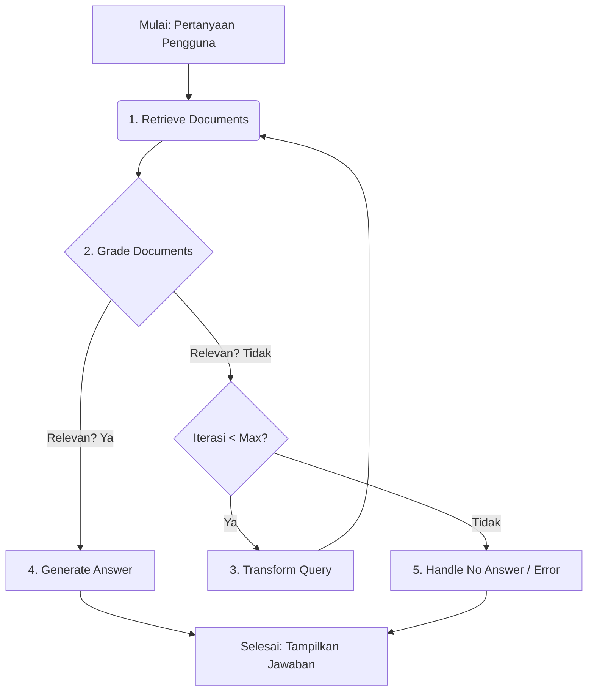

# Adaptive RAG System with LangGraph & Gemini API 🧠💡

[](https://python.org)
[](https://opensource.org/licenses/MIT)
Repositori ini berisi implementasi sistem **Retrieval Augmented Generation (RAG)** yang adaptif menggunakan **LangGraph** untuk membangun alur kerja yang stateful dan **Gemini API** dari Google sebagai Large Language Model (LLM) utama. Sistem ini dirancang untuk meningkatkan kualitas jawaban LLM dengan mengambil informasi relevan dari basis pengetahuan eksternal dan mampu beradaptasi jika informasi awal yang diambil kurang memuaskan.

---

## 📜 Deskripsi Proyek

Sistem RAG adaptif ini bertujuan untuk mengatasi keterbatasan LLM konvensional yang seringkali menghasilkan informasi yang tidak akurat (halusinasi) atau tidak memiliki pengetahuan tentang data yang sangat baru/spesifik. Dengan mengintegrasikan LLM dengan proses pengambilan informasi (retrieval) dan alur kerja yang cerdas menggunakan LangGraph, sistem ini dapat:

1.  Mengambil potongan informasi yang relevan dari basis data vektor (FAISS).
2.  Mengevaluasi relevansi informasi yang diambil menggunakan LLM.
3.  Jika informasi kurang relevan, sistem secara otomatis memformulasi ulang pertanyaan dan mencoba mengambil informasi kembali.
4.  Menghasilkan jawaban yang didasarkan pada informasi yang telah diverifikasi relevansinya.
5.  Menangani kasus di mana jawaban tidak dapat ditemukan dengan baik.

Proyek ini mendemonstrasikan bagaimana LangGraph dapat digunakan untuk membangun logika yang kompleks dan siklikal, memungkinkan LLM untuk "bernalar" dan mengambil tindakan berulang layaknya seorang agen cerdas.

---

## ✨ Fitur Utama

* **Retrieval Augmented Generation (RAG):** Meningkatkan LLM dengan pengetahuan eksternal.
* **Alur Kerja Adaptif dengan LangGraph:**
    * **Evaluasi Relevansi Dokumen yang Lebih Ketat:** LLM menilai apakah dokumen yang diambil cukup spesifik dan substansial untuk menjawab pertanyaan.
    * **Transformasi Pertanyaan Otomatis:** Jika dokumen tidak relevan, LLM memformulasi ulang pertanyaan untuk pencarian yang lebih baik dan lebih terfokus.
    * **Iterasi Terbatas:** Mencegah loop tak terbatas dengan membatasi jumlah upaya transformasi kueri (default: 3 iterasi).
* **Generasi Jawaban yang Lebih Direktif:** LLM diinstruksikan untuk fokus pada pertanyaan saat ini (yang mungkin telah diubah) dan secara eksplisit menjelaskan istilah kunci.
* **Integrasi dengan Gemini API:** Menggunakan model `gemini-2.0-flash` untuk tugas-tugas evaluasi, transformasi, dan generasi.
* **Basis Pengetahuan Lokal:** Menggunakan FAISS untuk pencarian kemiripan pada korpus dokumen yang disediakan.
* **Penanganan Error yang Informatif:** Memberikan pesan yang jelas dan penyebab yang disimpulkan ketika jawaban tidak dapat ditemukan.
* **Implementasi dalam Notebook Colab:** Mudah dijalankan dan dieksperimen.

---

## 🛠️ Teknologi yang Digunakan

* **Bahasa Pemrograman:** Python 3.9+
* **Orkestrasi LLM:** LangGraph, LangChain
* **Large Language Model (LLM):** Google Gemini API (model `gemini-2.0-flash`)
* **Embeddings:** HuggingFace Transformers (`sentence-transformers/all-MiniLM-L6-v2`)
* **Vector Store:** FAISS (Facebook AI Similarity Search)
* **Lingkungan Eksekusi:** Google Colaboratory (Notebook `.ipynb`)
* **Lainnya:** `httpx` untuk pemanggilan API asinkron, `nest_asyncio` untuk menjalankan `asyncio` di Colab.

---

## 🏗️ Arsitektur Sistem (Gambaran Umum)

Sistem ini dibangun sebagai sebuah _graph_ (grafik) stateful menggunakan LangGraph. Setiap _node_ dalam graph mewakili sebuah langkah dalam proses RAG, dan _edge_ (tepi) mengatur alur berdasarkan kondisi tertentu.



**Penjelasan Node Utama:**

1.  **`retrieve_documents`**: Mengambil dokumen dari FAISS berdasarkan `current_question`.
2.  **`grade_documents`**: Menggunakan Gemini API untuk menilai apakah dokumen yang diambil **spesifik, substansial, dan langsung relevan** untuk menjawab `original_question`. Prompt untuk node ini dibuat cukup ketat untuk mendorong transformasi jika relevansi kurang spesifik.
3.  **`transform_query`**: Jika dokumen tidak relevan dan iterasi belum maksimal, node ini menggunakan Gemini API untuk memformulasi ulang `original_question` menjadi `current_question` yang baru, lebih terfokus, dan lebih mungkin dijawab dengan informasi spesifik.
4.  **`generate_answer`**: Jika dokumen dinilai relevan, node ini menggunakan Gemini API untuk menghasilkan jawaban berdasarkan `current_question` dan konteks dokumen yang relevan. Prompt di sini didesain untuk fokus pada `current_question` dan secara eksplisit mendefinisikan/menjelaskan istilah kunci jika ada dalam pertanyaan.
5.  **`handle_no_answer`**: Jika jawaban tidak dapat ditemukan setelah beberapa upaya atau terjadi error, node ini akan memberikan pesan akhir yang informatif, termasuk penyebab yang telah disimpulkan berdasarkan state akhir.
6.  **`decide_next_step` (Conditional Edge Logic)**: Fungsi ini mengarahkan alur dari `grade_documents` ke `generate_answer`, `transform_query`, atau `handle_no_answer` berdasarkan relevansi konteks, jumlah iterasi, dan pesan error kritis yang ada.

---

## 🚀 Pengaturan dan Instalasi

Proyek ini dirancang untuk dijalankan di Google Colaboratory.

1.  **Prasyarat:**
    * Akun Google untuk mengakses Google Colab.
    * API Key untuk Google Gemini (diperoleh dari Google AI Studio).

2.  **Mendapatkan API Key Gemini:**
    * Kunjungi [Google AI Studio](https://aistudio.google.com/app/apikey).
    * Buat API Key baru jika Anda belum memilikinya.
    * Di Google Colab, simpan API Key Anda sebagai **secret**. Klik ikon kunci (🔑) di sidebar kiri, lalu "Add a new secret".
        * Nama secret: `GOOGLE_AI_STUDIO_API_KEY`
        * Value: API Key Anda
        * Pastikan "Notebook access" dicentang.
    * Kode dalam notebook akan mengambilnya menggunakan `userdata.get("GOOGLE_AI_STUDIO_API_KEY")`.

3.  **Menjalankan Notebook:**
    * Unggah file `.ipynb` (misalnya, `adaptive_rag_langgraph.ipynb`) ke Google Colab.
    * Jalankan sel pertama yang berisi perintah `!pip install ...` untuk menginstal semua dependensi yang diperlukan:
        ```python
        !pip install -qU langchain langgraph langchain_community langchain_core faiss-cpu sentence-transformers httpx nest_asyncio
        ```
    * Jalankan sel-sel berikutnya secara berurutan untuk mendefinisikan semua komponen dan mengompilasi graph.

---

## 💡 Cara Menggunakan

1.  Setelah semua sel definisi (impor, konfigurasi, state, node, graph) dijalankan, pergilah ke sel terakhir yang berjudul **"Jalankan Pertanyaan Anda Sendiri"**.
2.  Ubah nilai variabel `my_question` dengan pertanyaan yang ingin Anda ajukan ke sistem.
    ```python
    my_question = "Ceritakan tentang node di LangGraph." # Ganti dengan pertanyaan Anda
    asyncio.run(run_graph(my_question))
    ```
3.  Jalankan sel tersebut. Output proses, termasuk langkah-langkah yang diambil oleh graph dan jawaban akhir, akan ditampilkan.

**Contoh Pertanyaan untuk Dicoba:**

* `"Apa fungsi utama dari conditional edges dalam LangGraph?"` (Sebaiknya langsung dijawab dengan baik)
* `"Ceritakan tentang node di LangGraph."` (Sebaiknya memicu transformasi dan menghasilkan jawaban spesifik tentang node)
* `"Berapa harga saham Google hari ini?"` (Sebaiknya menghasilkan pesan tidak bisa menjawab dengan penyebab yang jelas setelah beberapa iterasi)
* `"Bagaimana cara membuat kue?"` (Untuk menguji relevansi dengan korpus yang ada dan melihat penanganan jika tidak relevan)

---

## 📄 Contoh Output Sukses

Berikut adalah contoh output yang menunjukkan kemampuan adaptif sistem ketika diberikan pertanyaan yang awalnya umum:

**Pertanyaan:** `"Ceritakan tentang node di LangGraph."`

```
🚀 Memulai eksekusi graph untuk pertanyaan: 'Ceritakan tentang node di LangGraph.'

🔍 Node: retrieve_documents (Iterasi: 0)
   Mencari untuk pertanyaan: 'Ceritakan tentang node di LangGraph.'
   📄 Ditemukan 3 dokumen.

🧐 Node: grade_documents
   Mengirim permintaan ke Gemini untuk evaluasi relevansi (dengan prompt lebih ketat)...
   ✅ Hasil evaluasi relevansi dari Gemini: no

🚦 Node Keputusan: decide_next_step
   Keputusan: Dokumen tidak relevan atau belum dievaluasi, iterasi 0 < 3. Menuju transform_query.

🔄 Node: transform_query
   Mengirim permintaan ke Gemini untuk transformasi query...
   ✅ Pertanyaan baru dari Gemini: 'Apa peran node dalam LangGraph?' 
   
🔍 Node: retrieve_documents (Iterasi: 1)
   Mencari untuk pertanyaan: 'Apa peran node dalam LangGraph?'
   📄 Ditemukan 3 dokumen.

🧐 Node: grade_documents
   Mengirim permintaan ke Gemini untuk evaluasi relevansi (dengan prompt lebih ketat)...
   ✅ Hasil evaluasi relevansi dari Gemini: yes

🚦 Node Keputusan: decide_next_step
   Keputusan: Dokumen relevan, menuju generate_answer.

💬 Node: generate_answer
   Mengirim permintaan ke Gemini untuk generasi jawaban (dengan prompt lebih direktif)...
   ✅ Jawaban dari Gemini: Dalam LangGraph, sebuah node adalah fungsi Python atau sebuah objek Runnable. Setiap node memproses state dan mengembalikan update state.

--- Hasil Akhir ---
Pertanyaan Asli: Ceritakan tentang node di LangGraph.
Pertanyaan Terakhir Digunakan: Apa peran node dalam LangGraph?
Jawaban yang Dihasilkan: Dalam LangGraph, sebuah node adalah fungsi Python atau sebuah objek Runnable. Setiap node memproses state dan mengembalikan update state.
Jumlah Iterasi: 1 
--- Selesai ---
```
*(Catatan: Jumlah iterasi pada contoh di atas mungkin perlu disesuaikan agar cocok dengan output terakhir Anda yang menunjukkan 2 iterasi untuk pertanyaan ini. Silakan perbarui sesuai hasil pengujian terakhir Anda.)*

---

## 🧠 Pembelajaran dan Wawasan Pengembangan

* **Prompt Engineering adalah Kunci:** Kualitas, kekhususan, dan ketegasan prompt untuk setiap interaksi LLM (evaluasi, transformasi, generasi) sangat memengaruhi perilaku dan hasil akhir sistem. Perubahan kecil pada prompt dapat menghasilkan perbedaan besar.
* **Iterasi Desain itu Penting:** Membangun sistem AI yang efektif adalah proses iteratif. Pengujian berkelanjutan, analisis kegagalan, dan penyempurnaan desain (terutama pada logika kondisional dan prompt) adalah fundamental.
* **Variabilitas LLM:** Perilaku LLM, bahkan untuk model yang sama pada input yang sama, bisa memiliki sedikit variasi (terutama untuk tugas yang lebih subjektif seperti grading relevansi). Merancang sistem yang cukup robust terhadap variabilitas ini adalah tantangan yang menarik.
* **Kekuatan LangGraph:** LangGraph menyediakan kerangka kerja yang sangat fleksibel dan kuat untuk mendefinisikan, mengelola, dan memvisualisasikan alur kerja AI yang kompleks, stateful, dan siklikal.

---

## 🔮 Potensi Pengembangan Lebih Lanjut

* **Strategi Retrieval yang Lebih Canggih:**
    * Implementasi _hybrid search_ (kombinasi pencarian semantik dan berbasis kata kunci).
    * Menambahkan langkah _re-ranking_ dokumen setelah pengambilan awal.
    * Teknik _query expansion_ yang lebih kompleks sebelum pencarian.
* **Integrasi Lebih Banyak Tools:** Memungkinkan agen untuk menggunakan alat lain selain retrieval (misalnya, kalkulator, pencarian web dinamis, eksekusi kode).
* **Evaluasi Otomatis Kualitas Jawaban:** Mengembangkan metrik dan skrip untuk mengevaluasi kualitas, relevansi, dan kekoherensian jawaban secara otomatis.
* **Fine-tuning Model:**
    * Fine-tuning model embedding pada domain spesifik untuk meningkatkan kualitas retrieval.
    * Fine-tuning LLM generator agar lebih baik dalam mengikuti instruksi atau menghasilkan jawaban dalam format tertentu.
* **Streaming Output:** Untuk respons yang lebih interaktif dan cepat dirasakan pengguna.
* **Persistensi State yang Lebih Robust:** Menggunakan _checkpointer_ LangGraph yang lebih canggih (misalnya, dengan database eksternal) untuk menyimpan dan melanjutkan state antar sesi atau untuk aplikasi multi-pengguna.
* **Antarmuka Pengguna (UI):** Membangun antarmuka pengguna sederhana (misalnya, menggunakan Streamlit atau Gradio) untuk interaksi yang lebih mudah.

---

## 📜 Lisensi

Proyek ini dilisensikan di bawah [Lisensi MIT](LICENSE).
*(Pastikan Anda membuat file `LICENSE` di root repositori Anda dan mengisi dengan teks lisensi MIT standar jika Anda memilih lisensi ini.)*

---

## 🙏 Apresiasi

* Terima kasih kepada tim LangChain dan LangGraph atas pengembangan pustaka yang luar biasa dan dokumentasi yang membantu.
* Terima kasih kepada Google atas penyediaan Gemini API.

---
